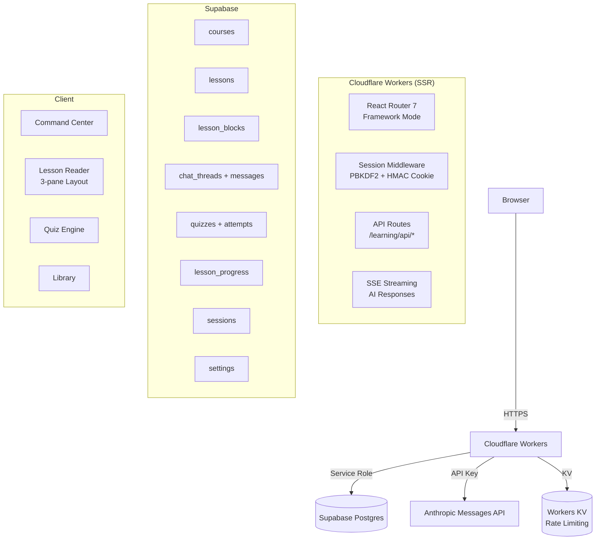

# Learning Platform — Architecture

## System Overview



## Auth Flow

1. User visits `/learning` → middleware checks `__Host-napats-learning` cookie
2. No cookie → redirect to `/learning/gate`
3. Gate: password → POST `/learning/api/session`
4. Server: PBKDF2 verify (600k iterations) → HMAC-SHA-256 signed cookie
5. Rate limiting: 5 attempts / 15 min per IP via Workers KV
6. Per-device revocation via `sessions` table in Supabase

## AI Integration

- Direct `fetch` to Anthropic Messages API (no SDK)
- SSE streaming from Workers to client
- Auto model routing:
  - `planCourse` → claude-opus-4-7
  - `generateLesson` / `chat` / `gradeShortAnswer` → claude-sonnet-4-6
  - `suggestTitle` / `summarise` → claude-haiku-4-5-20251001
- System prompts as typed template functions in `app/lib/ai/prompts/`
- Chat persona: "Minsu" — quiet, literary, editorial tone

## Content Safety

- AI-generated React/HTML rendered in `<iframe sandbox="allow-scripts">`
- No `dangerouslySetInnerHTML` on AI output
- Zod validation on all AI structured outputs before DB write
- Zod validation on all HTTP request bodies

## Data Flow

```
User types topic
  → POST /api/ai/plan-course (SSE stream)
  → User reviews + accepts outline
  → POST /api/courses (creates course + lessons in DB)
  → User opens lesson
  → POST /api/ai/generate-lesson (SSE stream → writes blocks to DB)
  → User reads, scrolls (progress tracked)
  → User clicks ◎ on block → chat opens with context
  → POST /api/ai/chat (SSE stream)
  → User requests refinement → POST /api/ai/refine-block
  → Diff preview → Accept/Reject
  → Mark complete → POST /api/ai/generate-quiz
  → Submit answers → POST /api/ai/grade
```
