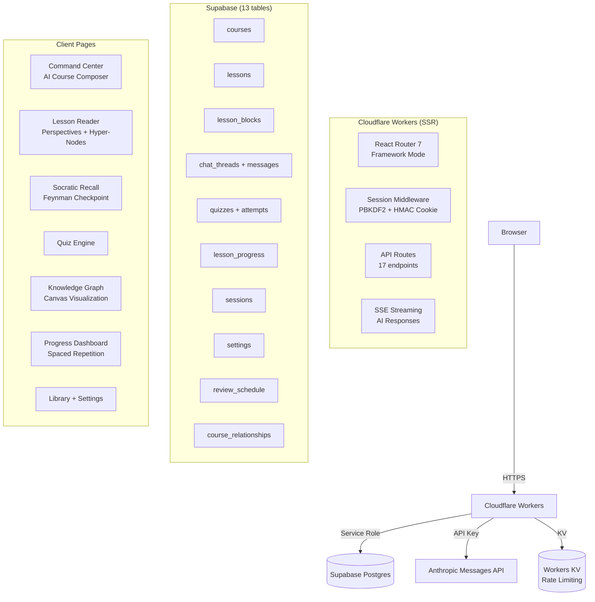

# Learning Platform — Architecture

## System Overview



## Auth Flow

1. User visits `/learning` → middleware checks `__Host-napats-learning` cookie
2. No cookie → redirect to `/learning/gate`
3. Gate: password → POST `/learning/api/session`
4. Server: PBKDF2 verify (600k iterations) → HMAC-SHA-256 signed cookie
5. Rate limiting: 5 attempts / 15 min per IP via Workers KV
6. Per-device revocation via `sessions` table in Supabase

## AI Integration

### Model Routing

| Action | Model | Use Case |
|--------|-------|----------|
| `planCourse` | Opus | Course planning (highest quality) |
| `generateLesson` | Sonnet | Full lesson generation |
| `perspectiveLesson` | Sonnet | Perspective-shifted content |
| `deepDive` | Sonnet | Hyper-node sub-lessons |
| `socraticRecall` | Sonnet | Feynman technique assessment |
| `generateQuiz` | Sonnet | Quiz creation |
| `gradeShortAnswer` | Sonnet | Answer evaluation |
| `chat` | Haiku/Sonnet | Short = Haiku, long = Sonnet |
| `suggestCourses` | Haiku | Fast recommendations |
| `buildGraph` | Haiku | Relationship extraction |
| `summarise` | Haiku | Quick summaries |

### Implementation
- Direct `fetch` to Anthropic Messages API (no SDK — edge compatible)
- SSE streaming from Workers to client via `ReadableStream`
- 13 system prompts as typed template functions in `app/lib/ai/prompts/`
- Chat persona: "Minsu" — quiet, literary, editorial tone
- Zod validation on all AI structured outputs before DB write

## Core Features

### Course Creation Flow
```
User types topic
  → Interactive AI conversation (multi-turn, suggestion chips)
  → AI auto-detects difficulty, checks existing library
  → Visual course preview card (no JSON visible)
  → User approves
  → POST /api/courses (creates course + lessons in DB)
```

### Lesson Experience Flow
```
User opens lesson
  → POST /api/ai/generate-lesson (SSE → blocks + concept map + hyper-nodes)
  → User reads (scroll progress tracked)
  → Click <hyper> term → POST /api/ai/deep-dive (inline sub-lesson, 3 levels)
  → Switch perspective lens → POST /api/ai/perspective-lesson (5 lenses)
  → Click ◎ on block → chat opens with context
  → Reach 90% scroll → Socratic Recall checkpoint activates
  → Must explain concept back to AI (Feynman Technique)
  → AI confirms understanding → next lesson unlocked
  → Spaced repetition review scheduled (1→3→7→14→30→60 days)
```

### Perspective Switching
5 analytical lenses that completely reframe lesson content:
- **Default** — Standard educational content
- **Evolutionary Biologist** — Natural selection, fitness landscapes, adaptation
- **Neuro-Engineer** — Neural circuitry, signal processing, system architecture
- **Philosopher** — Phenomenology, consciousness, epistemology
- **Software Architect** — Design patterns, distributed systems, engineering analogies

### Knowledge Graph
- Force-directed canvas visualization with pan/zoom
- AI-extracted relationships between courses (prerequisite, extends, complements)
- **Knowledge Entropy**: Ebbinghaus forgetting curve visualization
  - Bright nodes = recently reviewed
  - Faded/glitchy nodes = overdue for review
  - Legend: FRESH / FADING / NEEDS REVIEW

## API Endpoints (17)

| Endpoint | Method | Stream | Purpose |
|----------|--------|--------|---------|
| `/api/ai/plan-course` | POST | SSE | Conversational course planning |
| `/api/ai/generate-lesson` | POST | SSE | Lesson content generation |
| `/api/ai/perspective-lesson` | POST | SSE | Perspective-shifted content |
| `/api/ai/deep-dive` | POST | SSE | Hyper-node sub-lessons |
| `/api/ai/chat` | POST | SSE | Tutor chat + Socratic recall |
| `/api/ai/generate-quiz` | POST | — | Quiz generation |
| `/api/ai/grade` | POST | — | AI grading |
| `/api/ai/suggest-courses` | POST | — | Personalized suggestions |
| `/api/ai/related-courses` | POST | — | Post-completion suggestions |
| `/api/ai/build-graph` | POST | — | Knowledge graph extraction |
| `/api/ai/refine-block` | POST | SSE | Block editing |
| `/api/courses` | GET/POST | — | Course CRUD |
| `/api/settings` | GET/PUT | — | User preferences |
| `/api/progress/:id` | GET/PUT | — | Lesson progress + recall status |
| `/api/review-schedule` | GET/PUT | — | Spaced repetition |
| `/api/graph` | GET | — | Graph nodes + edges |
| `/api/session` | POST/DELETE | — | Auth |

## Database Schema (13 tables)

```
sessions              — Per-device auth tracking
courses               — Course metadata + tags
lessons               — Ordered lessons per course
lesson_blocks         — Content blocks (9 types, JSONB)
lesson_block_history  — Edit history for undo
lesson_progress       — Scroll %, status, recall checkpoint
chat_threads          — Scoped to course/lesson/block
chat_messages         — Full conversation history
quizzes               — Generated quiz questions (JSONB)
quiz_attempts         — Student answers + scores
settings              — Key-value preferences
review_schedule       — Spaced repetition intervals
course_relationships  — Knowledge graph edges
```

## Content Safety

- AI-generated React/HTML rendered in `<iframe sandbox="allow-scripts">`
- Zod validation on all AI structured outputs before DB write
- Zod validation on all HTTP request bodies (7 schemas)
- CSRF protection via Origin header check
- Session-based auth on all API routes
